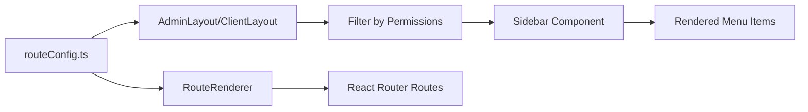

# How to Add a New Page to the Sidebar

## 📋 Overview

This guide explains how to add a new page to the sidebar in the LMS platform. The sidebar system uses a **centralized route configuration** approach that automatically handles:
- Permission-based access control
- Dynamic sidebar rendering
- Nested menu support
- Icon integration
- Role-based routing (Admin vs Student)

## 🏗️ System Architecture

### Key Components
1. **`routeConfig.ts`** - Centralized route definitions with permissions
2. **`Sidebar.tsx`** - Dynamic sidebar component that renders menu items
3. **`RouteRenderer.tsx`** - Converts route configs to React Router routes
4. **`AdminLayout.tsx` / `ClientLayout.tsx`** - Layout wrappers that filter routes by permissions
5. **`permissions.ts`** - Permission constant definitions

### Data Flow


## 📝 Step-by-Step Guide

### Step 1: Create Your Page Component

Create your page component in the appropriate directory:
- Admin pages: `src/pages/admin/<feature>/`
- Student pages: `src/pages/client/<feature>/`

**Example:** Creating an admin page for managing students

```typescript
// src/pages/admin/students/StudentList.tsx
import React from "react";

export default function StudentList() {
  return (
    <div>
      <h1>Student Management</h1>
      <p>Manage all students here...</p>
    </div>
  );
}
```

Export it from `src/pages/index.ts`:
```typescript
// src/pages/index.ts
export { default as StudentList } from "./admin/students/StudentList";
```

### Step 2: Define Permission (Admin Only)

If you're adding an **admin page**, define the permission in `src/constants/permissions.ts`:

```typescript
// src/constants/permissions.ts
export const ADMIN_PERMISSIONS = {
  DASHBOARD: "LMS_DASHBOARD_VIEW",
  REWARDS: {
    VIEW: "LMS_REWARDS_VIEW",
    CREATE: "LMS_REWARDS_ADD",
    // ... existing permissions
  },
  // ✅ Add your new permission
  STUDENTS: {
    VIEW: "LMS_STUDENTS_VIEW",
    CREATE: "LMS_STUDENTS_ADD",
    EDIT: "LMS_STUDENTS_EDIT",
    DELETE: "LMS_STUDENTS_DELETE",
  }
} as const;
```

**Note:** Student/Client pages use a generic `"client.access"` permission and don't require specific permission definitions.

### Step 3: Add Route Configuration

Add your route to the appropriate route map in `src/constants/routeConfig.ts`:

#### For Admin Pages:

```typescript
// src/constants/routeConfig.ts
import { Users } from "lucide-react"; // Import icon
import { StudentList } from "../pages"; // Import component

export const ADMIN_ROUTE_MAP: Record<string, RouteConfig> = {
  DASHBOARD: {
    // ... existing routes
  },
  REWARDS: {
    // ... existing routes
  },
  // ✅ Add your new route
  STUDENTS: {
    path: "/dashboard/admin/students",
    permission: ADMIN_PERMISSIONS.STUDENTS.VIEW,
    label: "Students",
    icon: React.createElement(Users, { size: 18 }),
    component: StudentList,
  },
};
```

#### For Student/Client Pages:

```typescript
// src/constants/routeConfig.ts
export const CLIENT_ROUTE_MAP: Record<string, RouteConfig> = {
  DASHBOARD: {
    // ... existing routes
  },
  // ✅ Add your new route
  MY_COURSES: {
    path: "/dashboard/student/courses",
    permission: "client.access",
    label: "My Courses",
    icon: React.createElement(BookOpen, { size: 18 }),
    component: MyCourses,
  },
};
```

### Step 4: Add Nested Routes (Optional)

To create a menu with sub-items, use the `children` property:

```typescript
STUDENTS: {
  path: "/dashboard/admin/students",
  permission: ADMIN_PERMISSIONS.STUDENTS.VIEW,
  label: "Students",
  icon: React.createElement(Users, { size: 18 }),
  children: [
    {
      path: "/dashboard/admin/students/list",
      permission: ADMIN_PERMISSIONS.STUDENTS.VIEW,
      label: "Student List",
      icon: React.createElement(List, { size: 18 }),
      component: StudentList,
    },
    {
      path: "/dashboard/admin/students/create",
      permission: ADMIN_PERMISSIONS.STUDENTS.CREATE,
      label: "Add Student",
      icon: React.createElement(UserPlus, { size: 18 }),
      component: CreateStudent,
    },
  ],
},
```

## 🎨 Choosing Icons

The project uses **Lucide React** icons. Browse available icons at: https://lucide.dev/icons/

**Common icons:**
- `LayoutDashboard` - Dashboard
- `Users` - Users/Students
- `BookOpen` - Courses/Books
- `Award` - Achievements/Certificates
- `Settings` - Settings
- `Calendar` - Calendar/Schedule
- `FileText` - Documents/Reports
- `BarChart3` - Analytics/Stats

**Import and use:**
```typescript
import { BarChart3 } from "lucide-react";

icon: React.createElement(BarChart3, { size: 18 }),
```

## ✅ Complete Example

Here's a full example of adding a "Reports" page with sub-pages:

### 1. Create Components
```typescript
// src/pages/admin/reports/SalesReport.tsx
export default function SalesReport() {
  return <div>Sales Report</div>;
}

// src/pages/admin/reports/UserReport.tsx
export default function UserReport() {
  return <div>User Report</div>;
}
```

### 2. Export from index
```typescript
// src/pages/index.ts
export { default as SalesReport } from "./admin/reports/SalesReport";
export { default as UserReport } from "./admin/reports/UserReport";
```

### 3. Add Permissions
```typescript
// src/constants/permissions.ts
export const ADMIN_PERMISSIONS = {
  // ... existing
  REPORTS: {
    VIEW: "LMS_REPORTS_VIEW",
    SALES: "LMS_REPORTS_SALES",
    USERS: "LMS_REPORTS_USERS",
  }
};
```

### 4. Add Route Configuration
```typescript
// src/constants/routeConfig.ts
import { FileBarChart } from "lucide-react";
import { SalesReport, UserReport } from "../pages";

export const ADMIN_ROUTE_MAP: Record<string, RouteConfig> = {
  // ... existing routes
  REPORTS: {
    path: "/dashboard/admin/reports",
    permission: ADMIN_PERMISSIONS.REPORTS.VIEW,
    label: "Reports",
    icon: React.createElement(FileBarChart, { size: 18 }),
    children: [
      {
        path: "/dashboard/admin/reports/sales",
        permission: ADMIN_PERMISSIONS.REPORTS.SALES,
        label: "Sales Report",
        icon: React.createElement(TrendingUp, { size: 18 }),
        component: SalesReport,
      },
      {
        path: "/dashboard/admin/reports/users",
        permission: ADMIN_PERMISSIONS.REPORTS.USERS,
        label: "User Report",
        icon: React.createElement(Users, { size: 18 }),
        component: UserReport,
      },
    ],
  },
};
```

## 🔒 How Permissions Work

### Admin Routes
- Each admin route requires a specific permission (e.g., `LMS_STUDENTS_VIEW`)
- The backend provides these permissions when the admin logs in
- `AdminLayout.tsx` automatically filters routes using `filterRoutesByPermissions()`
- Only routes matching the user's permissions appear in the sidebar

### Student/Client Routes
- All student routes use the generic `"client.access"` permission
- No permission filtering occurs for students
- All defined student routes automatically appear in their sidebar

## 🚀 That's It!

After following these steps, your new page will:
- ✅ Automatically appear in the sidebar
- ✅ Be protected by permission checks (for admin)
- ✅ Support navigation and routing
- ✅ Display the correct icon
- ✅ Support nested menus if configured

## 📚 File Reference

| File | Purpose |
|------|---------|
| `src/constants/routeConfig.ts` | Route definitions with permissions and components |
| `src/constants/permissions.ts` | Permission constant definitions |
| `src/components/Sidebar.tsx` | Sidebar rendering logic |
| `src/components/layouts/AdminLayout.tsx` | Admin layout with permission filtering |
| `src/components/layouts/ClientLayout.tsx` | Student layout (no filtering) |
| `src/config/RouteRenderer.tsx` | Converts route configs to React Router routes |
| `src/pages/index.ts` | Central export point for all page components |

## 🔍 Troubleshooting

**Page doesn't appear in sidebar:**
- Check that the permission exists in `permissions.ts` (admin only)
- Verify the route is added to the correct `ROUTE_MAP`
- Ensure the component is properly exported from `src/pages/index.ts`
- Confirm user has the required permission (check backend response)

**Route not working:**
- Verify `component` property is set on the route config
- Check that path matches the pattern expected by `RouteRenderer`
- Ensure component is imported correctly in `routeConfig.ts`

**Icon not showing:**
- Verify icon is imported from `lucide-react`
- Use `React.createElement(IconName, { size: 18 })`
- Check for typos in icon name
